<!--
 * @Author: Damon Liu
 * @Date: 2025-06-11 11:00:19
 * @LastEditors: Damon Liu
 * @LastEditTime: 2025-06-19 10:57:09
 * @Description: 
-->
# MCP日程表 Server README

这是与`[VSCode插件/Trae/Cursor/Lingma]MCP日程表` 配套使用的 `MCP Server` 端。  

`MCP Server` 端用于`VSCode/Trae/Cursor/Lingma` 端大模型通过`libp2p`和`mDNS`实现局域网内的对等网络和`MCP日程表插件`点对点通讯实现 **增、删、查取**插件端日程的功能。

**插件地址：**

[MCP日程表 - Visual Studio Marketplace](https://marketplace.visualstudio.com/items?itemName=damonliu.schedules-for-mcp)


或在`VSCode`搜索`MCP日程表`（作者：damonliu） 安装

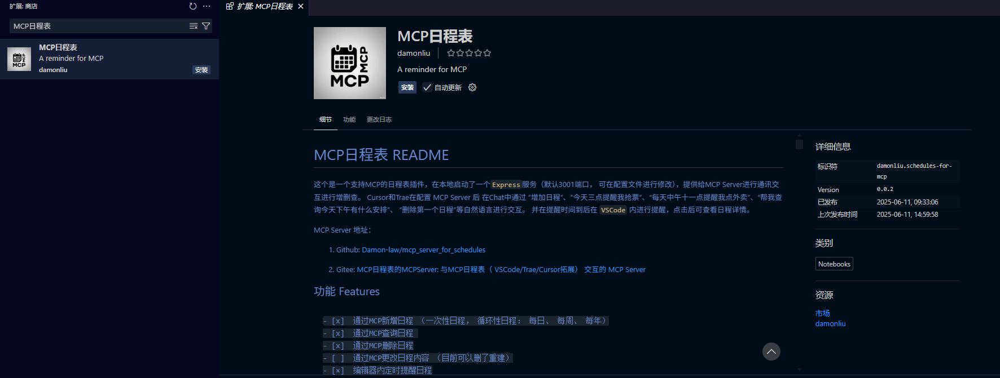

`Trae` 中导入 `VSCode` 插件的 方式可见：

[管理插件 - 文档 - Trae CN](https://docs.trae.com.cn/ide/manage-extensions)

**使用教程：**

1. 安装插件后
2. 克隆项目到本地
3. 安装依赖：`npm install` 或 `pnpm install`
4. 运行项目：`npm run build` 或 `pnpm build`
5. 在对应的`IDE`或`编辑器`中配置``
   ```js
        {
            "mcpServers": {
                "schedules": {
                // 配置了fnm的情况下, 先指定你使用的node版本
                "command": "fnm exec --using=20.10.0 node 你的路径\\mcp_server_for_schedules\\build\\index.js",
                // 正常node
                "command": "node 你的路径\\mcp_server_for_schedules\\build\\index.js"
                }
            }
        }
    ```
6. 在对应的`Chat`中通过“增加日程”、“今天三点提醒我抢票”、“每天中午十一点提醒我点外卖”、“帮我查询今天下午有什么安排”、 “删除第一个日程”等自然语言进行交互。 并在提醒时间到后在 `VSCode` 内进行提醒，点击后可查看日程详情。


## Tool 工具

目前提供了以下`tool`:

- [x]  `add-schedule`： 添加日程或提醒，如果用户没有指定结束时间: end，则默认结束时间为开始时间: start或提醒时间: reminder加一小时
- [x]  `get-current-date`： 获取当前日期，进行日程操作时先执行这个更新日期 
- [x]  `get-schedules`： 根据时间区间获取当前日程
- [×]  `delete-schedule`: 删除日程
- [x]  `clear-all-schedules`: 清空所有日程
- [ ]  ...


常见编辑器简易使用教程：

### Cursor中使用
Cursor中使用方法：
1. **安装插件**
2. **配置MCP Server**
    ```js
        {
            "mcpServers": {
                "schedules": {
                // 配置了fnm的情况下，先指定你使用的node版本
                "command": "fnm exec --using=20.10.0 node 你的路径\\mcp_server_for_schedules\\build\\index.js"
                // 正常node
                "command": "node 你的路径\\mcp_server_for_schedules\\build\\index.js"
                }
            }
        }
    ```
    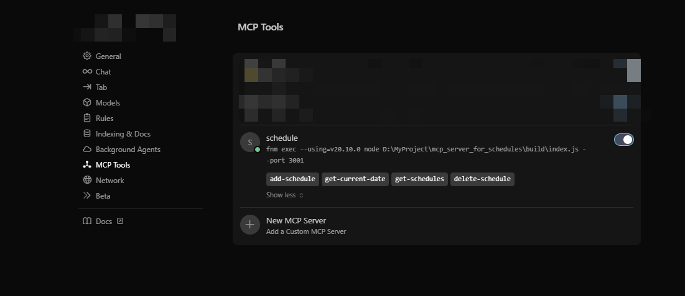


3. **新增循环日程**


    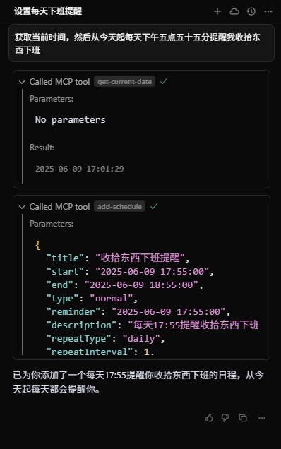

    

4. **新增一次性日程**
     

    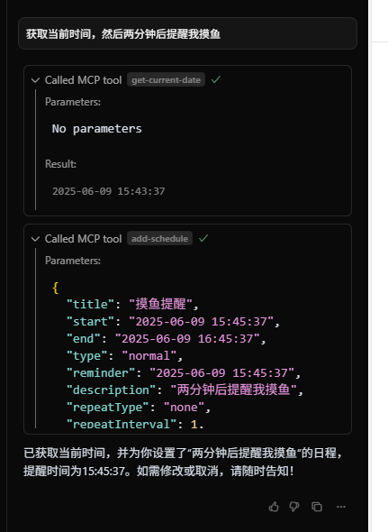


5.  **到时间显示提醒**
   

    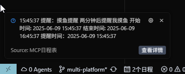


6.  **查看提醒详情**
      

    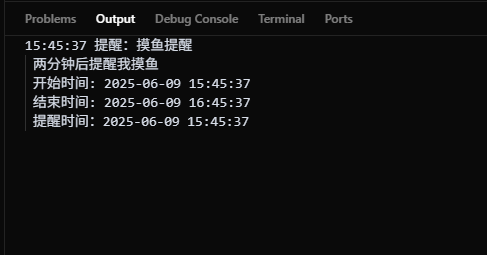

7.  **查询日程**

    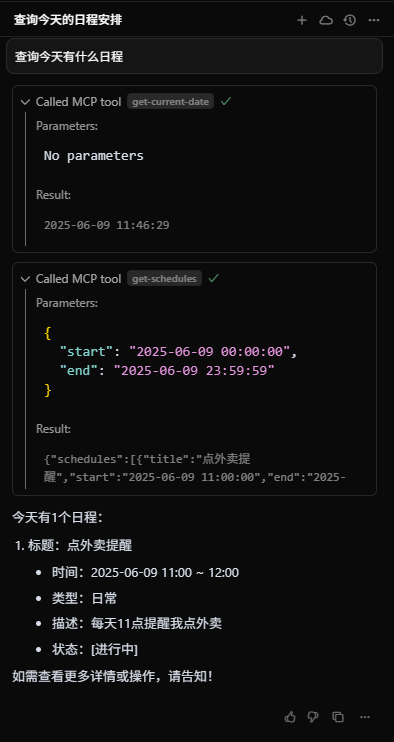

    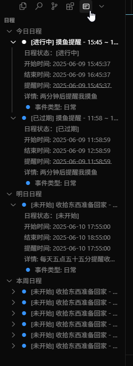


8.  **删除日程**

    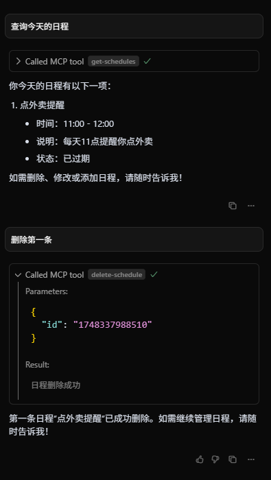


### Trae中使用

Trae中使用方法：

`Trae` **中的 通知好像是默认设置为勿打扰模式，需要手动打开通知：**


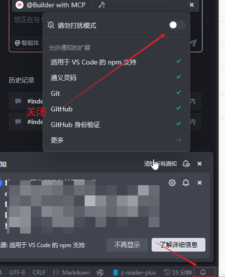


1. **安装插件**
2. **配置MCP Server**
    ```js
        {
            "mcpServers": {
                "schedules": {
                // 配置了fnm的情况下，先指定你使用的node版本
                "command": "fnm exec --using=20.10.0 node 你的路径\\mcp_server_for_schedules\\build\\index.js"
                // 正常node
                "command": "node 你的路径\\mcp_server_for_schedules\\build\\index.js"
                }
            }
        }
    ```

    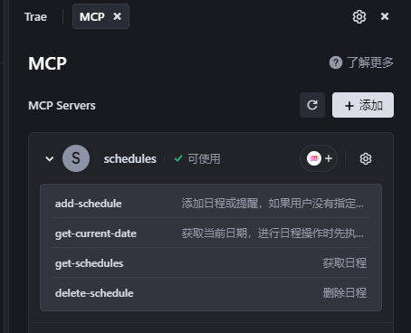

3. **再对下中选择智能体MCP即可使用**
   
   
   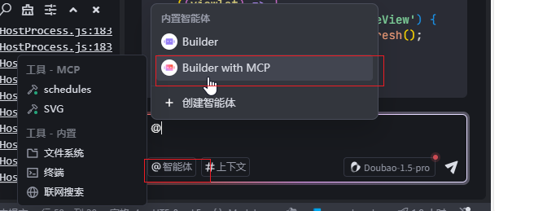 
  

4. **新增循环日程**
  
   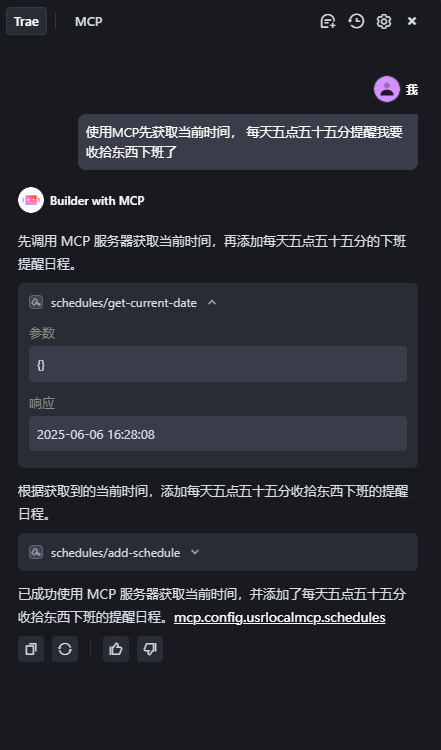


5. **新增一次性日程**


   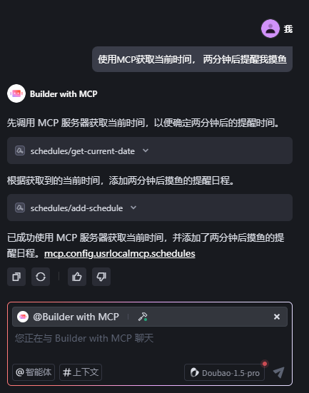


6.  **到时间显示提醒**


    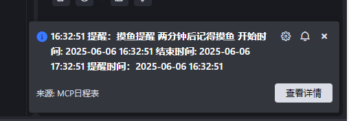 


7.  **查看提醒详情**


    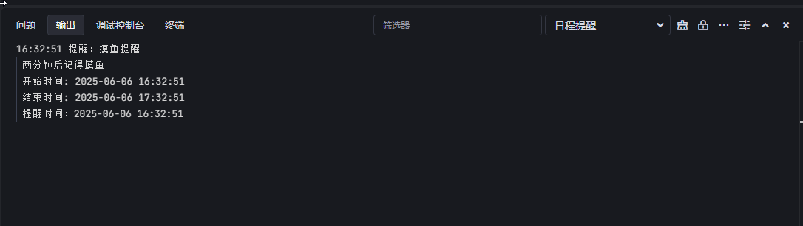


8.  **查询日程**

    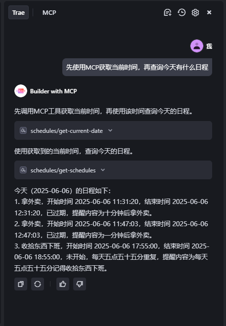

    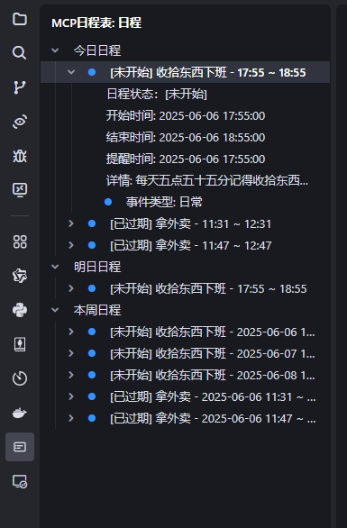

9.  **删除日程**

    


## 更多 More

拓展开源。

`MCP日程表`仓库地址：

1. gitte: [MCP日程表的MCPServer: 与MCP日程表（ VSCode/Trae/Cursor拓展） 交互的 MCP Server](https://gitee.com/damon592/mcp_server_for_schedules)

2. github: [schedules-extension-for-mcp](https://github.com/Damon-law/schedules-extension-for-mcp)


详细内容和开发可查看掘金：

[赛博丁真Damon 的个人主页 - 动态 - 掘金](https://juejin.cn/user/4332493267283560)

